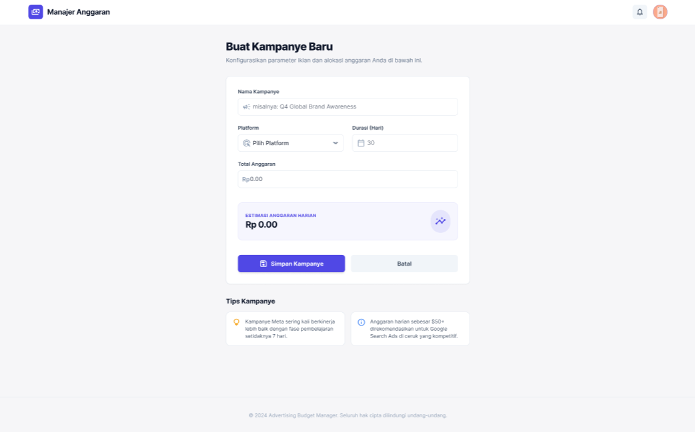

# 🚀 Tugas Besar: Sistem Pengelolaan Anggaran Iklan Digital

> **Dosen Pengampu:** Muhammad Shiddiq Azis, S.T., MBA

---

## 📊 Perancangan Sistem (DFD)

### DFD Level 0

*Diagram konteks yang menunjukkan interaksi antara Admin, User, dan sistem.*

### DFD Level 1

*Detail proses utama seperti input campaign, pengelolaan budget, realisasi biaya, dan laporan.*

---

## 🎨 Mockup Antarmuka
Rancangan UI aplikasi yang berfokus pada kemudahan penggunaan dan monitoring anggaran.

| Dashboard | Kelola Campaign | Input Realisasi (User) |
| :---: | :---: | :---: |
|  |  |  |

---

## 🛠️ Stack Teknologi
- **Frontend:** React + Vite  
- **Backend:** Node.js  
- **Database:** Supabase (PostgreSQL)

---

## 📂 Cara Instalasi
1. Clone repository
   ```bash
   git clone https://github.com/ervnn/apk-budgetiklan.git
2. cd nama-repo
3. npm install
4. npm run dev
