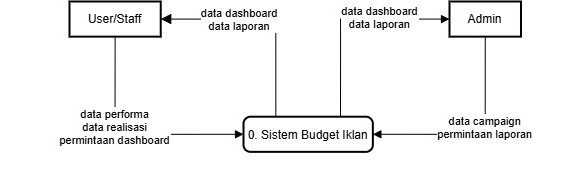
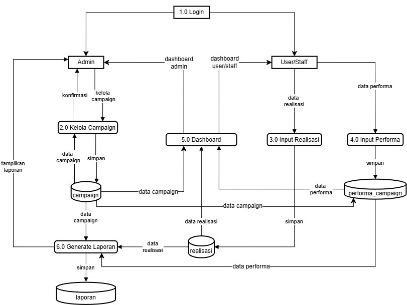
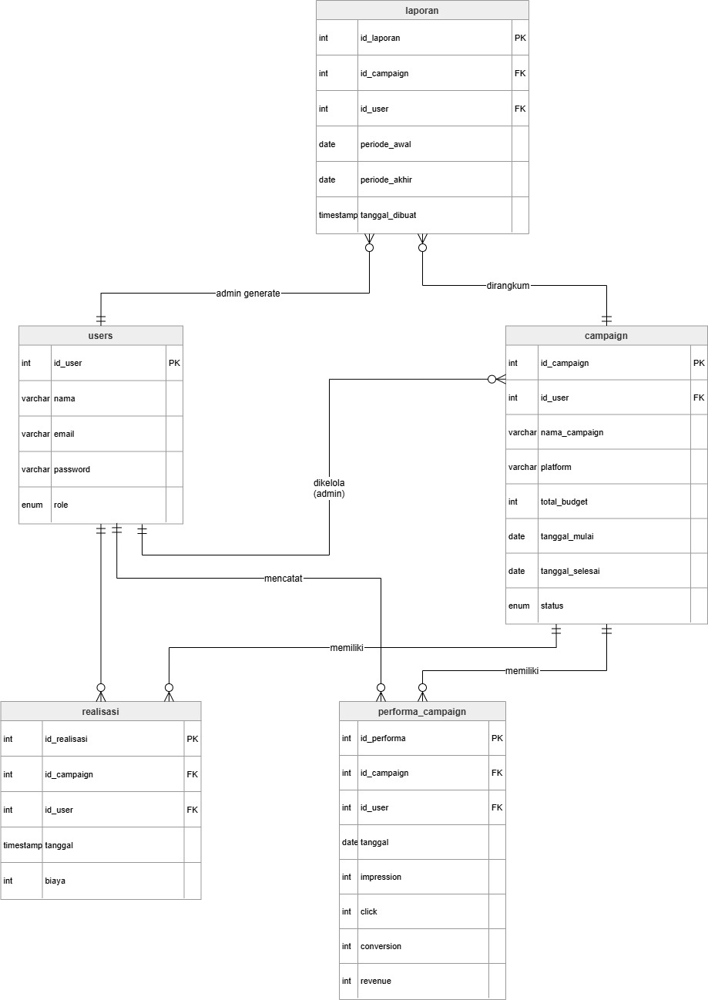

# 📊 Tugas Besar: Sistem Pengelolaan Anggaran Iklan Digital

## 👨‍🏫 Dosen Pengampu
Muhammad Shiddiq Azis, S.T., MBA

---

## 👥 Kelompok 12
- **Ervin Setyanata Kusuma** - [103012430007]
- **Tristan Amar Fauzan** - [1030124300512]
- **Nelson Arbet** - [103012400250]

---

## 🛠️ Teknologi yang Digunakan
- **Frontend**: React (Vite), CSS Modern, Lucide Icons
- **Backend**: Node.js, Express.js, JWT, BcryptJS
- **Database**: PostgreSQL (Supabase)
- **Security**: Helmet, Express-Rate-Limit

---

## 📌 Deskripsi Singkat

Aplikasi ini digunakan untuk membantu pengguna dalam mengelola anggaran iklan digital secara terstruktur.  
Terdapat dua role utama:
- **Admin** → mengelola campaign dan anggaran
- **User** → mencatat realisasi biaya iklan dan performa iklan harian

---

# 📊 Data Flow Diagram (DFD)

## 🔹 DFD Level 0

## 🔹 DFD Level 1

## 🔹 ERD (Database)

## 🔹 Sequence Diagram
[Buka Folder Sequence Diagram](./assets/sequence_diagram)

---

# 🔐 Tampilan Sistem (Admin)

## 🔹 Login Page

## 🔹 Admin Dashboard

## 🔹 Campaign Management

## 🔹 Create Campaign

## 🔹 Laporan Admin

---

# 👤 Tampilan Sistem (User)

## 🔹 Login Page

## 🔹 Dashboard User

## 🔹 Input Anggaran / Realisasi Biaya

## 🔹 Input Performa Iklan Harian

---

# ⚙️ Fitur Utama

### 👨‍💼 Admin
- Menambahkan campaign iklan
- Mengatur total budget
- Melihat laporan keseluruhan (Grafik & Tabel)
- Mengelola data campaign
- Export Laporan (PDF & CSV)

### 👤 User
- Memilih campaign
- Menginput realisasi biaya
- Menginput performa iklan harian
- Melihat laporan dashboard user

---

## 🚀 Cara Menjalankan Aplikasi (Local Development)

### 1. Menjalankan Backend
1. Buka terminal dan masuk ke folder `backend`: `cd backend`
2. Install dependensi: `npm install`
3. Salin atau ubah `.env.example` menjadi `.env` dan pastikan kredensial Supabase sudah sesuai.
4. Jalankan server: `npm run dev` (berjalan di port 5000)

### 2. Menjalankan Frontend
1. Buka terminal baru dan masuk ke folder `frontend`: `cd frontend`
2. Install dependensi: `npm install`
3. Salin atau ubah file env (jika ada) sesuai URL backend.
4. Jalankan aplikasi: `npm run dev` (berjalan di localhost dengan port bawaan Vite/React)

---

## 🔗 Link Eksternal & Progres
- **URL Postman Collection**: [Postman Link](https://www.postman.com/science-observer-47017782/impal/collection/odter3v/budgeting-apps)

---

- **URL Demo Aplikasi**: [https://frontend-production-3768.up.railway.app]
account admin : [admin@gmail.com]
password : admin123

account user : [staff@gmail.com]
password : staff123

---

- **User Manual**: [In Progress]

