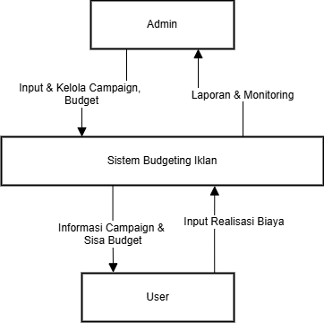
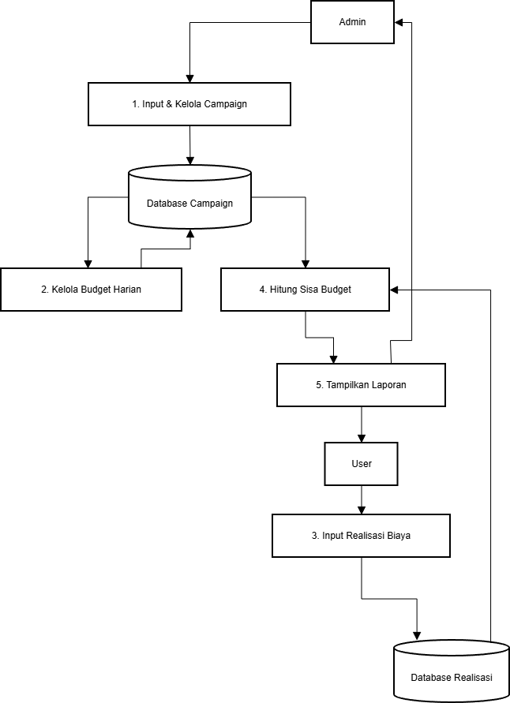
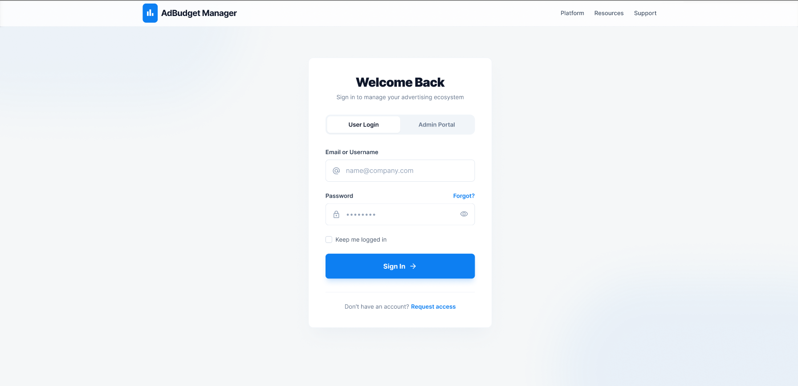

# 📊 Tugas Besar: Sistem Pengelolaan Anggaran Iklan Digital

## 👨‍🏫 Dosen Pengampu
Muhammad Shiddiq Azis, S.T., MBA

---

## 🛠️ Teknologi yang Digunakan

- **Frontend**: (contoh: HTML, CSS, JavaScript / React / Vue)
- **Backend**: (contoh: Node.js / Golang / PHP / Java Spring)
- **Database**: (contoh: MySQL / PostgreSQL / MongoDB)

---

## 📌 Deskripsi Singkat

Aplikasi ini digunakan untuk membantu pengguna dalam mengelola anggaran iklan digital secara terstruktur.  
Terdapat dua role utama:
- **Admin** → mengelola campaign dan anggaran
- **User** → mencatat realisasi biaya iklan

---

# 📊 Data Flow Diagram (DFD)

## 🔹 DFD Level 0

## 🔹 DFD Level 1

---

# 🔐 Tampilan Sistem (Admin)

## 🔹 Login Page

## 🔹 Admin Dashboard

## 🔹 Campaign Management

## 🔹 Create Campaign

## 🔹 Laporan Admin

---

# 👤 Tampilan Sistem (User)

## 🔹 Dashboard User

## 🔹 Input Anggaran / Realisasi Biaya

## 🔹 Laporan User

---

# ⚙️ Fitur Utama

### 👨‍💼 Admin
- Menambahkan campaign iklan
- Mengatur total budget
- Melihat laporan keseluruhan
- Mengelola data campaign

### 👤 User
- Memilih campaign
- Menginput realisasi biaya
- Melihat sisa budget
- Melihat laporan penggunaan anggaran

---
